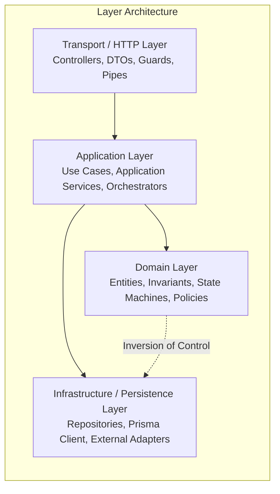

# Architectural Boundaries & Dependency Rules

To maintain the structural integrity of the Veylix modular monolith and prevent coupling, all code must strictly obey the following boundary rules.

---

## 1. Layer Boundary Rules

1. **Transport Layer (Controllers, Guards, Interceptors, Pipes, DTOs)**:
   - **Rule**: Controllers MUST be thin. They receive HTTP requests, trigger validation pipes, pass validated DTOs/commands to Application Services, and map outputs to HTTP responses.
   - **Prohibition**: Controllers MUST NEVER execute raw database queries, contain business logic rules, or manage transactions.

2. **Application Layer (Use Cases, Application Services)**:
   - **Rule**: Coordinates domain logic, manages database transaction boundaries (`prisma.$transaction`), and orchestrates side-effects (movements, audit events).
   - **Prohibition**: Application services MUST NOT depend on HTTP request/response objects (`express.Request`, `Response`).

3. **Domain Layer (Entities, State Machines, Invariants, Policies)**:
   - **Rule**: Pure domain logic. Enforces invariants (e.g. `INV-001` through `INV-007`), validates state transitions, and verifies authorization policies.
   - **Prohibition**: Domain classes MUST NOT depend on Prisma, database clients, or external web frameworks.

4. **Infrastructure Layer (Repositories, Adapters, Prisma Client)**:
   - **Rule**: Implements persistence interfaces, translates domain queries into SQL/Prisma operations, and handles external integrations.
   - **Prohibition**: Infrastructure repositories MUST NOT implement business decision rules.

---

## 2. Inter-Module Communication Rules

1. **Explicit Public Services Only**:
   - Module A may only call the exported `Service` or `Facade` of Module B.
   - Module A MUST NOT import internal repositories, private helpers, or entities of Module B.
2. **No Cross-Module Direct Database Writes**:
   - Module A MUST NOT directly execute `prisma.asset.update(...)` if `Asset` belongs to `AssetsModule`. It must invoke `AssetsService.transferAsset(...)`.
3. **Transaction Sharing**:
   - When a use case spans multiple modules (e.g. Asset Transfer creating an `AssetMovement` and writing an `AuditLog`), the calling Application Service passes the active Prisma transaction client (`tx`) to the participating module services.

---

## 3. Package Boundary Rules (`packages/*`)

1. `packages/ui`:
   - Pure presentation components, design tokens, and primitives.
   - MUST NOT import from `apps/*`, `@prisma/client`, or server-only packages.
2. `packages/types`:
   - Shared TypeScript type definitions, DTO interfaces, and enums.
   - Zero runtime dependencies.
3. `packages/validation`:
   - Shared runtime validation schemas (Zod).
   - Depends only on `packages/types` and `zod`.
