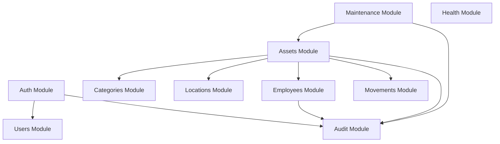

# Module Catalog & Architecture

Veylix API is structured into 10 cohesive, loosely-coupled domain modules within `apps/api/src/modules/`.

---

## Module Specifications

### 1. `AuthModule`

- **Purpose**: User identity verification, session lifecycle management, password resets, and brute-force protection.
- **Key Components**: `AuthService`, `SessionService`, `PasswordResetService`, `Argon2Hasher`, `LocalAuthGuard`, `SessionAuthGuard`.
- **Public Interface**: `validateSession(token: string): Promise<AuthenticatedUser>`.
- **Dependencies**: `UsersModule`, `AuditModule`.

### 2. `UsersModule`

- **Purpose**: System user management, role assignments (`ADMIN`, `OPERATOR`, `VIEWER`), and permission policies.
- **Key Components**: `UsersService`, `UsersRepository`, `UserPolicy`.
- **Public Interface**: `findUserById(id: string)`, `findUserByEmail(email: string)`.
- **Dependencies**: `AuditModule`.

### 3. `EmployeesModule`

- **Purpose**: Corporate personnel directory, department structures, and asset custodianship records.
- **Key Components**: `EmployeesService`, `EmployeesRepository`, `EmployeePolicy`.
- **Public Interface**: `getEmployeeById(id: string)`, `verifyEmployeeActive(id: string)`.
- **Dependencies**: `AuditModule`.

### 4. `CategoriesModule`

- **Purpose**: Asset classification hierarchy, taxonomy codes, and category-level metadata.
- **Key Components**: `CategoriesService`, `CategoriesRepository`.
- **Public Interface**: `getCategoryById(id: string)`.
- **Dependencies**: None.

### 5. `LocationsModule`

- **Purpose**: Physical infrastructure registry (sites, buildings, floors, rooms).
- **Key Components**: `LocationsService`, `LocationsRepository`.
- **Public Interface**: `getLocationById(id: string)`, `verifyLocationActive(id: string)`.
- **Dependencies**: None.

### 6. `AssetsModule`

- **Purpose**: Core asset lifecycle, inventory registry, patrimony code assignment, state machine enforcement, and transfer orchestration.
- **Key Components**: `AssetsService`, `AssetStateMachine`, `TransferAssetUseCase`, `AssignAssetUseCase`, `RetireAssetUseCase`, `AssetsRepository`, `AssetPolicy`.
- **Public Interface**: `getAssetById(id: string)`, `transitionAssetStatus(id: string, transition, tx)`.
- **Dependencies**: `CategoriesModule`, `LocationsModule`, `EmployeesModule`, `MovementsModule`, `AuditModule`.

### 7. `MovementsModule`

- **Purpose**: Historical chain-of-custody tracking, recording every asset transfer, reassignment, or physical location change.
- **Key Components**: `MovementsService`, `MovementsRepository`.
- **Public Interface**: `recordMovement(movementData, tx): Promise<AssetMovement>`.
- **Dependencies**: None.

### 8. `MaintenanceModule`

- **Purpose**: Work order management, scheduled inspections, corrective repairs, downtime tracking, and repair cost logging.
- **Key Components**: `MaintenanceService`, `OpenMaintenanceUseCase`, `CloseMaintenanceUseCase`, `MaintenanceRepository`, `MaintenancePolicy`.
- **Public Interface**: `getActiveMaintenanceForAsset(assetId: string)`.
- **Dependencies**: `AssetsModule`, `AuditModule`.

### 9. `AuditModule`

- **Purpose**: Append-only security and operational audit trail recording actor identity, IP, request ID, trace ID, and entity diffs.
- **Key Components**: `AuditService`, `AuditRepository`, `AuditInterceptor`.
- **Public Interface**: `logEvent(event: AuditLogEntry, tx?: PrismaTx): Promise<void>`.
- **Dependencies**: None (leaf module).

### 10. `HealthModule`

- **Purpose**: Infrastructure diagnostics, Kubernetes/container liveness and readiness probes, database ping.
- **Key Components**: `HealthController`, `DatabaseHealthIndicator`.
- **Public Interface**: Endpoints `/health/liveness` and `/health/readiness`.
- **Dependencies**: None.
