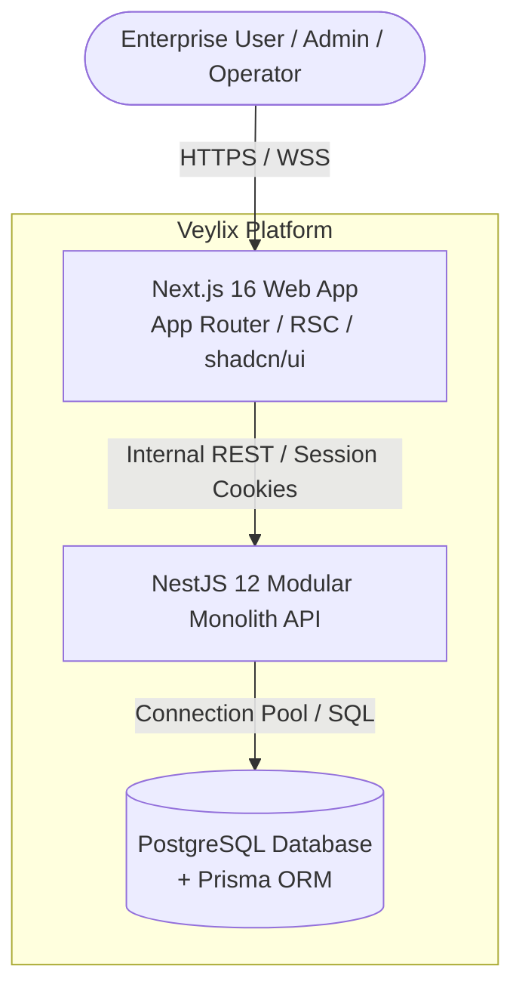

# Architecture Overview

## 1. System Vision & Context

Veylix is an enterprise-grade Asset Inventory and Lifecycle Management Platform. It centralizes physical asset tracking, custodial assignments, transfers, maintenance workflows, and depreciation auditing across an organization's physical sites, departments, and personnel.

---

## 2. Architectural Paradigm: Modular Monolith

Veylix is architected as a **Modular Monolith**:

- **Why a Monolith?** Physical asset management is inherently relational and transactional (e.g., transferring an asset requires atomic verification of the asset state, updating the current employee assignment, logging a historical movement, and recording an audit trail). A monolithic deployment eliminates distributed transaction complexities (2PC/Saga), network latency between services, and operational overhead.
- **Why Modular?** Clean module boundaries prevent the codebase from devolving into an untangled "Big Ball of Mud". Each domain (Assets, Employees, Maintenance, Audit, Auth) is encapsulated in a dedicated NestJS module with explicit public interfaces and strict dependency rules.

---

## 3. High-Level Technology Stack

### 3.1 Frontend (`apps/web`)

- **Framework**: Next.js 16 (App Router) + React 19 + TypeScript (Strict).
- **Rendering Strategy**: Server Components (RSC) by default for data fetching and initial rendering; Client Components (`"use client"`) only at interactive boundary leaves (forms, modals, interactive data tables).
- **Styling & UI**: Tailwind CSS + shadcn/ui + Lucide Icons.
- **Design System**: Isolated in `packages/ui` and documented via Storybook.

### 3.2 Backend (`apps/api`)

- **Framework**: NestJS 12 + TypeScript (Strict).
- **Architecture Pattern**: Clean Layered Architecture per module:
  $$\text{Controller (HTTP/DTO)} \longrightarrow \text{Application Service / Use Case} \longrightarrow \text{Domain Rules / Policies} \longrightarrow \text{Repository} \longrightarrow \text{Prisma ORM}$$
- **API Protocol**: RESTful JSON with OpenAPI 3.1 / Swagger contracts.
- **Authentication**: Database-backed sessions with Argon2id password hashing and `HttpOnly`, `Secure`, `SameSite` cookies.

### 3.3 Persistence & Storage

- **Database**: PostgreSQL 16+.
- **Data Access**: Prisma ORM with strongly typed schema, strict foreign keys, check constraints, and optimistic concurrency versioning.

### 3.4 Observability

- **Logging**: Pino (structured JSON logging with standard field schema).
- **Tracing & Metrics**: OpenTelemetry Node SDK with distributed context propagation (`trace_id`, `span_id`, `request_id`).

---

## 4. Cross-Cutting Architectural Concerns

1. **State Machine Integrity**: Asset state changes (`AVAILABLE`, `IN_USE`, `MAINTENANCE`, `RETIRED`, `LOST`) are strictly governed by an explicit State Machine. Direct updates to asset status bypass are forbidden.
2. **Concurrency Protection**: Critical operations (e.g. transfers, maintenance state shifts) use optimistic locking (`version` column) and pessimistic row locking (`SELECT FOR UPDATE`) within Prisma transactions.
3. **Audit Trail**: Every mutating domain and security event emits an immutable record in `AuditLog` containing actor details, request ID, trace ID, and JSONB before/after deltas.
4. **Idempotency**: Sensitive mutating endpoints accept an optional `Idempotency-Key` header to prevent duplicate executions from network retries.
