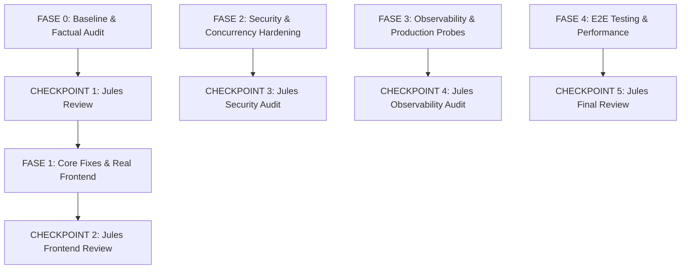

# Veylix — Current State Assessment & Baseline Audit (Phase 2 — Fase 0)

**Date**: 2026-09-17  
**Author**: Antigravity (Lead Orchestrator / Lead Engineer)  
**Target Milestone**: Phase 2 — Product Completion, Security Hardening & Production Readiness  
**Target Reviewer**: Jules (Autonomous Coding Peer / Reviewer) — Checkpoint 1  
**Repository Branch**: `feature/phase-2-fase-0-assessment`  
**Git Commit Baseline**: `b041cb8` (Post-Etapa 8 / Checkpoint G merge)

---

## 1. Executive Summary

This document establishes the empirical, fact-based baseline audit of the **Veylix** platform at the kickoff of **Phase 2: Product Completion, Security Hardening & Production Readiness**.

In Phase 1 (Etapas 0 through 8), the foundational architecture of the modular monolith was constructed, including domain models, state machines, transactional persistence with Prisma, RBAC authorization, and production Docker container configurations.

However, an exhaustive factual audit reveals a fundamental architectural duality:

1. **The Backend Foundation is Sophisticated but Contains Critical Operational Traps**: While core domain services and state machines are rigorously tested (168 tests in API), two high-severity defects were uncovered in health probes (`SEC/OPS-001`) and request correlation persistence (`SEC/OPS-002`). Furthermore, critical business endpoints (such as `GET /api/auth/me` and dashboard metrics aggregation) are absent.
2. **The Frontend is Largely a Shell with Hardcoded Mocks**: The Next.js application currently compiles exactly **two routes** (`/` and `/api/health`). All primary application paths (`/login`, `/assets`, `/assets/[id]`, `/maintenance`, `/employees`, `/locations`, `/categories`, `/audit-logs`) return HTTP 404. The root dashboard renders hardcoded mock items (`mockMovements`) with inert buttons and zero API connectivity.
3. **Documentation Drift vs Reality**: While `docs/observability/overview.md` details OpenTelemetry spans, metrics, and trace IDs, OpenTelemetry packages and Prometheus metric exporters are entirely absent from the codebase.

This audit details the facts with exact line citations, reproduction proofs, severity ratings, and a phased remediation strategy.

---

## 2. Priority Hypotheses Validation

### 2.1 SEC/OPS-001 — Health Check Protected by Authentication

- **Status**: **CONFIRMED**
- **Severity**: **HIGH** (Causes production container crash/restart cascade)

#### Factual Finding & Evidence

In NestJS, guards registered with `APP_GUARD` in `AppModule` execute globally for all HTTP endpoints. In [`apps/api/src/app.module.ts`](file:///home/sirbu/projects/veylix/apps/api/src/app.module.ts#L52-L54):

```typescript
{
  provide: APP_GUARD,
  useClass: AuthGuard,
},
```

In [`apps/api/src/common/guards/auth.guard.ts`](file:///home/sirbu/projects/veylix/apps/api/src/common/guards/auth.guard.ts#L20-L35), `AuthGuard` checks if the handler or class contains the `IS_PUBLIC_KEY` metadata:

```typescript
const isPublic = this.reflector.getAllAndOverride<boolean>(IS_PUBLIC_KEY, [
  context.getHandler(),
  context.getClass(),
]);

if (isPublic) {
  return true;
}

const request = context.switchToHttp().getRequest();
const token = this.extractTokenFromHeader(request);

if (!token) {
  throw new UnauthorizedException("Authentication token is missing");
}
```

In [`apps/api/src/modules/health/health.controller.ts`](file:///home/sirbu/projects/veylix/apps/api/src/modules/health/health.controller.ts#L7-L19):

```typescript
@SkipThrottle()
@ApiTags("Health")
@Controller("health")
export class HealthController {
  constructor(private readonly healthService: HealthService) {}

  @Get("liveness")
  getLiveness(@Res() res: Response) {
...
```

`HealthController` is decorated with `@SkipThrottle()`, but **lacks the `@Public()` decorator** at both class and method levels.

While [`apps/api/src/main.ts`](file:///home/sirbu/projects/veylix/apps/api/src/main.ts#L66-L68) sets:

```typescript
app.setGlobalPrefix("api", {
  exclude: ["health/liveness", "health/readiness"],
});
```

This configuration only omits the `/api` route prefix; it **does NOT exempt routes from global guards**.

#### Cascading Operational Impact

1. When external probers (Kubernetes, AWS ALB, Docker engine) query `GET /health/liveness` without a session cookie or Bearer token, `AuthGuard` rejects the request with HTTP `401 Unauthorized`.
2. In [`apps/api/Dockerfile`](file:///home/sirbu/projects/veylix/apps/api/Dockerfile#L59-L60):
   ```dockerfile
   HEALTHCHECK --interval=15s --timeout=5s --start-period=10s --retries=3 \
     CMD wget --no-verbose --tries=1 --spider http://localhost:4000/health/liveness || exit 1
   ```
   `wget` receives HTTP 401 and exits with non-zero exit status (code 8). Docker marks the container status as `unhealthy` after 3 retries (45s).
3. In [`docker-compose.yml`](file:///home/sirbu/projects/veylix/docker-compose.yml#L69-L72):
   ```yaml
   web:
     depends_on:
       api:
         condition: service_healthy
   ```
   Because `api` never transitions to `healthy`, `web` is permanently prevented from starting.

#### Proposed Remediation

1. Apply `@Public()` decorator to `HealthController` in `apps/api/src/modules/health/health.controller.ts`.
2. Ensure `/health/liveness` returns a minimal lightweight payload (`{ status: "ok", timestamp, uptime }`) without exposing internal database or infrastructure credentials.
3. Ensure `/health/readiness` performs a ping against dependencies (PostgreSQL via `PrismaService.isHealthy()`), returning 200 when healthy and 503 when degraded.
4. Add automated integration tests in `apps/api/test/health.spec.ts` executing HTTP calls through the NestJS pipeline with `AuthGuard` active to verify unauthenticated 200 OK responses.

---

### 2.2 SEC/OPS-002 — X-Request-Id / Request Correlation Header Handling

- **Status**: **CONFIRMED**
- **Severity**: **HIGH** (Causes transaction aborts, database denial of service, and header injection)

#### Factual Finding & Evidence

In [`apps/api/src/common/middleware/request-id.middleware.ts`](file:///home/sirbu/projects/veylix/apps/api/src/common/middleware/request-id.middleware.ts#L17-L33):

```typescript
const incomingId = req.headers[REQUEST_ID_HEADER];
const requestId =
  typeof incomingId === "string" && incomingId.trim().length > 0
    ? incomingId
    : `req_${randomUUID()}`;

const incomingTrace = req.headers[TRACE_ID_HEADER];
const traceId =
  typeof incomingTrace === "string" && incomingTrace.trim().length > 0
    ? incomingTrace
    : `trace_${randomUUID()}`;

vReq.requestId = requestId;
vReq.traceId = traceId;
res.setHeader(REQUEST_ID_HEADER, requestId);
res.setHeader(TRACE_ID_HEADER, traceId);
next();
```

#### Vulnerabilities & Flaws Identified

1. **Database Schema Constraint Mismatch (Transaction Abort)**:
   In [`prisma/schema.prisma`](file:///home/sirbu/projects/veylix/prisma/schema.prisma#L245-L246):
   ```prisma
   model AuditLog {
     ...
     requestId    String   @map("request_id") @db.VarChar(64)
     traceId      String?  @map("trace_id") @db.VarChar(64)
   ```
   PostgreSQL enforces a strict 64-character limit on `AuditLog.request_id` and `AuditLog.trace_id`.
   When `AssetService.transferAsset`, `AssetService.assignAsset`, or `MaintenanceService.openMaintenance` runs inside an interactive database transaction (`prisma.$transaction`), it attempts to write `meta.requestId` to `AuditLog`.
   If a client or upstream proxy sends an `X-Request-Id` of 65 characters or more, PostgreSQL raises an unrecoverable error:
   `P2000: The provided value for the column is too long for the column's type. Column: request_id`.
   **The entire atomic business transaction is rolled back**, causing the asset transfer or maintenance ticket to fail with HTTP 500.
2. **HTTP Response Header Injection**:
   `RequestIdMiddleware` blindly echoes `requestId` via `res.setHeader(REQUEST_ID_HEADER, requestId)`. Without stripping CR/LF (`\r\n`) or non-printable ASCII/control characters, this creates header pollution and potential response splitting risks.
3. **Log Injection & Memory Bloat**:
   An attacker sending a multi-megabyte string in `X-Request-Id` bloats in-memory log serializers (Pino) and error response payloads.

#### Proposed Remediation

1. Define a strict sanitization and validation routine for `X-Request-Id` and `X-Trace-Id`:
   - Allowed format: `^[a-zA-Z0-9_-]{1,64}$`
   - Maximum length: 64 characters.
2. If the incoming header is absent, empty, longer than 64 characters, or contains invalid characters, discard it and safely fallback to generating `req_${randomUUID()}` and `trace_${randomUUID()}`.
3. Add unit and property-based tests in `apps/api/test/request-id.spec.ts` testing oversized strings, control characters, newlines, and valid UUIDs.

---

## 3. Architecture Assessment

### 3.1 Monorepo Structure and Workspaces

The monorepo is orchestrated via Turborepo 2.10.12 and pnpm 10.2.0:

- `apps/api`: NestJS 11 backend application.
- `apps/web`: Next.js 16.3.4 App Router frontend application.
- `packages/ui`: Design system library with Tailwind CSS 3.4 / Radix primitives.
- `packages/types`: Shared domain contracts, enums, and API interfaces.
- `packages/validation`: Zod schemas and validation helpers.
- `packages/eslint-config`: Shared ESLint configurations.
- `packages/typescript-config`: Shared tsconfig bases.
- `prisma`: Database schema, migrations, seed script.

### 3.2 Implemented vs Documented Discrepancies (Drift)

| Architectural Component         | Documented Status                                                              | Actual Codebase Implementation                                                                                      | Discrepancy Level                |
| :------------------------------ | :----------------------------------------------------------------------------- | :------------------------------------------------------------------------------------------------------------------ | :------------------------------- |
| **OpenTelemetry Tracing**       | `docs/observability/overview.md` describes span context injection and OTel SDK | `@opentelemetry/sdk-node` is NOT installed. No tracer is initialized in `apps/api/src/main.ts`.                     | **Critical Documentation Drift** |
| **System Metrics / Prometheus** | `docs/observability/overview.md` mentions Prometheus/OTel metrics collection   | No metrics module, no `@willsoto/nestjs-prometheus`, no `/metrics` route.                                           | **Critical Documentation Drift** |
| **Pino Context Injection**      | Logs claimed to automatically contain `request_id`, `trace_id`, `user_id`      | `AppLogger` does NOT bind to AsyncLocalStorage or request context automatically. Only explicit contexts are logged. | **Moderate Architectural Gap**   |
| **Frontend Application**        | `AGENTS.md` and `docs/STATE.md` describe application shell and design system   | Shell exists, but all business domain pages return 404; zero API integration.                                       | **Major Product Gap**            |

### 3.3 Boundaries and Technical Debt

- **Domain Boundaries**: Respected in `apps/api`. Controllers delegate cleanly to application services (`AssetService`, `MaintenanceService`).
- **Persistence Boundaries**: Operations use Prisma client within service layers; raw SQL is restricted to pessimistic locking (`SELECT ... FOR UPDATE`) in transactions.
- **Cross-Module Leakage**: None detected. Services inject domain dependencies cleanly.
- **Frontend State Management**: Currently zero global store, which complies with KISS/YAGNI. However, there is no shared API client or query cache library configured.

---

## 4. Backend Assessment

### 4.1 Endpoint Matrix & Operational Status

All 8 backend controllers are registered in `AppModule`. The following matrix documents their route signature, required authorization roles, and implementation status:

| Module          | Method & Route                     | Roles Allowed                | Implementation Type            | Current Operational Status              |
| :-------------- | :--------------------------------- | :--------------------------- | :----------------------------- | :-------------------------------------- |
| **Health**      | `GET /health/liveness`             | None (intended)              | Real Service                   | **BROKEN** (Blocked by `AuthGuard` 401) |
| **Health**      | `GET /health/readiness`            | None (intended)              | Real Service (DB ping)         | **BROKEN** (Blocked by `AuthGuard` 401) |
| **Auth**        | `POST /api/auth/login`             | Public (`@Throttle(10/min)`) | Real (Argon2id + DB Session)   | **FUNCTIONAL**                          |
| **Auth**        | `POST /api/auth/logout`            | Authenticated                | Real (Session Invalidation)    | **FUNCTIONAL**                          |
| **Asset**       | `GET /api/assets`                  | Admin, Operator, Viewer      | Real (Paginated + Filtered)    | **FUNCTIONAL**                          |
| **Asset**       | `GET /api/assets/:id`              | Admin, Operator, Viewer      | Real (Details + Relations)     | **FUNCTIONAL**                          |
| **Asset**       | `POST /api/assets`                 | Admin, Operator              | Real (Transactional Create)    | **FUNCTIONAL**                          |
| **Asset**       | `PATCH /api/assets/:id`            | Admin, Operator              | Real (Optimistic Locking)      | **FUNCTIONAL**                          |
| **Asset**       | `POST /api/assets/:id/assign`      | Admin, Operator              | Real (Transactional + INV-001) | **FUNCTIONAL**                          |
| **Asset**       | `POST /api/assets/:id/transfers`   | Admin, Operator              | Real (Transactional + INV-004) | **FUNCTIONAL**                          |
| **Asset**       | `POST /api/assets/:id/return`      | Admin, Operator              | Real (Transactional + INV-002) | **FUNCTIONAL**                          |
| **Asset**       | `POST /api/assets/:id/retire`      | Admin, Operator              | Real (Transactional + INV-002) | **FUNCTIONAL**                          |
| **Asset**       | `GET /api/assets/:id/movements`    | Admin, Operator, Viewer      | Real (Custody History)         | **FUNCTIONAL**                          |
| **Maintenance** | `POST /api/maintenance`            | Admin, Operator              | Real (Transactional + INV-006) | **FUNCTIONAL**                          |
| **Maintenance** | `GET /api/maintenance`             | Admin, Operator, Viewer      | Real (Paginated Tickets)       | **FUNCTIONAL**                          |
| **Maintenance** | `GET /api/maintenance/:id`         | Admin, Operator, Viewer      | Real (Ticket Details)          | **FUNCTIONAL**                          |
| **Maintenance** | `PATCH /api/maintenance/:id`       | Admin, Operator              | Real (Ticket Update)           | **FUNCTIONAL**                          |
| **Maintenance** | `POST /api/maintenance/:id/close`  | Admin, Operator              | Real (Transactional + INV-006) | **FUNCTIONAL**                          |
| **Maintenance** | `POST /api/maintenance/:id/cancel` | Admin, Operator              | Real (Transactional + INV-006) | **FUNCTIONAL**                          |
| **Category**    | `GET /api/categories`              | Admin, Operator, Viewer      | Real (Active List)             | **FUNCTIONAL**                          |
| **Category**    | `GET /api/categories/:id`          | Admin, Operator, Viewer      | Real (Details)                 | **FUNCTIONAL**                          |
| **Employee**    | `GET /api/employees`               | Admin, Operator, Viewer      | Real (Active List)             | **FUNCTIONAL**                          |
| **Employee**    | `GET /api/employees/:id`           | Admin, Operator, Viewer      | Real (Details)                 | **FUNCTIONAL**                          |
| **Location**    | `GET /api/locations`               | Admin, Operator, Viewer      | Real (Active List)             | **FUNCTIONAL**                          |
| **Location**    | `GET /api/locations/:id`           | Admin, Operator, Viewer      | Real (Details)                 | **FUNCTIONAL**                          |
| **Audit**       | `GET /api/audit-logs`              | Admin, Operator              | Real (Paginated Audit Log)     | **FUNCTIONAL**                          |

### 4.2 Missing Business Endpoints

1. **`GET /api/auth/me`**: Crucial endpoint missing. The frontend has no mechanism to fetch the authenticated user profile (`id`, `name`, `email`, `role`) on initial page load or hard refresh.
2. **`GET /api/dashboard/stats`**: No summary KPI endpoint exists. The frontend dashboard currently hardcodes counts ("1,428", "$2.84M"). An aggregated analytics endpoint returning total assets, active in custody, in maintenance, and total valuation is required.
3. **Mutations for Auxiliary Entities**: Categories, Employees, and Locations currently only support `GET`. Administrators cannot create or update employees or locations via the API.

### 4.3 Domain Invariants Verification

- **INV-001 (At most one custodian)**: Enforced via `assignedEmployeeId` on Asset entity and atomic verification.
- **INV-002 & INV-003 (Lifecycle state transitions)**: Enforced in `AssetStateMachine.ts` and validated via 28 unit tests and 15 fast-check property tests.
- **INV-004 (Atomic movement generation)**: Enforced inside `prisma.$transaction` across transfer, assign, and return flows.
- **INV-005 (Immutable audit trail)**: Enforced across mutations. However, vulnerable to transaction rollback via `SEC/OPS-002` if `requestId` > 64 chars.
- **INV-006 (Maintenance work order state synchronization)**: Enforced in `MaintenanceService` (opening transitions asset to `MAINTENANCE`, closing restores `AVAILABLE` or `IN_USE`).
- **INV-007 (Concurrency controls)**: Enforced with optimistic `version` checks and `SELECT ... FOR UPDATE` row locks.

---

## 5. Frontend Assessment

### 5.1 Route Inventory & Status Matrix

The Next.js compiler output verifies that only `/` and `/api/health` are compiled:

```text
Route (app)
┌ ○ /
├ ○ /_not-found
└ ƒ /api/health
```

The table below maps all expected application routes against actual existence and operational status:

| Route Path              | Expected Purpose             | Present in Code?                    | Connected to API? | Mock Data?                | Status            |
| :---------------------- | :--------------------------- | :---------------------------------- | :---------------- | :------------------------ | :---------------- |
| `/`                     | Dashboard & Recent Movements | Yes (`src/app/page.tsx`)            | **NO**            | **YES** (`mockMovements`) | **Mock Only**     |
| `/login`                | User Authentication          | **NO**                              | **NO**            | N/A                       | **404 NOT FOUND** |
| `/assets`               | Asset Inventory Directory    | **NO**                              | **NO**            | N/A                       | **404 NOT FOUND** |
| `/assets/new`           | Register Asset Form          | **NO**                              | **NO**            | N/A                       | **404 NOT FOUND** |
| `/assets/[id]`          | Asset Details & Lifecycle    | **NO**                              | **NO**            | N/A                       | **404 NOT FOUND** |
| `/assets/[id]/assign`   | Assign Custodian Modal/Page  | **NO**                              | **NO**            | N/A                       | **404 NOT FOUND** |
| `/assets/[id]/transfer` | Transfer Custody Modal/Page  | **NO**                              | **NO**            | N/A                       | **404 NOT FOUND** |
| `/assets/[id]/return`   | Return Asset Modal/Page      | **NO**                              | **NO**            | N/A                       | **404 NOT FOUND** |
| `/movements`            | Custody Movement Audit Log   | **NO**                              | **NO**            | N/A                       | **404 NOT FOUND** |
| `/maintenance`          | Work Orders List & Status    | **NO**                              | **NO**            | N/A                       | **404 NOT FOUND** |
| `/maintenance/new`      | Open Maintenance Ticket Form | **NO**                              | **NO**            | N/A                       | **404 NOT FOUND** |
| `/maintenance/[id]`     | Ticket Details & Close Form  | **NO**                              | **NO**            | N/A                       | **404 NOT FOUND** |
| `/employees`            | Employee Custodian Directory | **NO**                              | **NO**            | N/A                       | **404 NOT FOUND** |
| `/locations`            | Physical Facility Directory  | **NO**                              | **NO**            | N/A                       | **404 NOT FOUND** |
| `/categories`           | Asset Categories List        | **NO**                              | **NO**            | N/A                       | **404 NOT FOUND** |
| `/audit-logs`           | Immutable Audit Trail        | **NO**                              | **NO**            | N/A                       | **404 NOT FOUND** |
| `/settings`             | System Settings              | **NO**                              | **NO**            | N/A                       | **404 NOT FOUND** |
| `/api/health`           | Web Health Probe             | Yes (`src/app/api/health/route.ts`) | Self-contained    | No                        | **FUNCTIONAL**    |

### 5.2 Frontend Components & API Layer Findings

1. **Hardcoded Dashboard (`apps/web/src/app/page.tsx`)**:
   - Four static cards: "1,428", "1,180", "42", "$2.84M".
   - Hardcoded array of 4 items (`mockMovements`).
   - "Register Asset" and "Transfer Custody" buttons have no event handlers or navigation targets.
2. **Dead Links in Navigation (`components/layout/sidebar.tsx` & `command-palette.tsx`)**:
   - Sidebar links for `/assets`, `/movements`, `/maintenance`, `/employees`, `/locations`, `/categories`, `/audit-logs`, and `/settings` all trigger Next.js 404 pages.
   - User profile in sidebar hardcodes "Administrator", "admin@veylix.corp".
3. **API Client**:
   - There is no central API client, fetch wrapper, or HTTP interceptor in `apps/web`.
   - No cookie forwarding or error response handling is implemented on the frontend.
4. **Design System Coverage (`packages/ui`)**:
   - High-quality presentation components exist: `DataTable`, `StatCard`, `PageHeader`, `StatusBadge`, `Button`, `Input`, `Table`, `Alert`, `Skeleton`.
   - **Gaps**: Missing wrapped form primitives (`Select`, `Textarea`, `Dialog/Modal`, `DropdownMenu`) needed for asset creation, transfers, and maintenance workflows.

---

## 6. Security Assessment

### 6.1 Authentication & Session Management

- **Password Storage**: Argon2id hashing with cryptographic salt in `apps/api/src/modules/auth/auth.service.ts`. Compliant with OWASP standards.
- **Session Tokens**: 32-byte cryptographic random hex token; stored in database as SHA-256 hash (`sessionTokenHash`).
- **Cookie Security**:
  ```typescript
  res.cookie("veylix_session", result.sessionToken, {
    httpOnly: true,
    secure: process.env.NODE_ENV === "production",
    sameSite: "lax",
    path: "/",
    maxAge: 7 * 24 * 60 * 60 * 1000, // 7 days
  });
  ```
- **Identified Gap**: No mechanism to refresh sessions or revoke all active sessions for a compromised user account.

### 6.2 Authorization & RBAC

- **Roles**: `ADMIN`, `OPERATOR`, `VIEWER`.
- **Enforcement**: Decorator `@Roles(...)` evaluated by `RolesGuard`.
- **Security RBAC Tests**: 19 tests in `apps/api/test/security-rbac.spec.ts` verify role boundaries on protected endpoints.
- **Identified Gap**: No permission model on the frontend; UI does not currently check user role before rendering actions.

### 6.3 CSRF & HTTP Security

- **CSRF Protection**:
  - The API relies entirely on `SameSite=Lax` cookies.
  - While modern browsers restrict cross-site POST requests under Lax cookies, there is no anti-CSRF token or requirement for custom request headers (e.g. `X-Requested-With` or `X-CSRF-Token`).
- **CORS**:
  - Whitelist parsed from `CORS_ORIGINS` environment variable. `credentials: true` enabled.
- **Helmet & CSP**:
  - Helmet active with HSTS (1 year, includeSubDomains, preload).
  - CSP allows `'unsafe-inline'` for scripts and styles (configured for Next.js compatibility).
- **Payload Limits**:
  - Express `json({ limit: "1mb" })` prevents oversized request bodies.

---

## 7. Testing Assessment

### 7.1 Test Suite Inventory (186 Passing Tests)

Current execution across all packages shows 186 passed tests in 21 suites:

- **`apps/api` (168 tests, 17 suites)**:
  - `asset-state-machine.spec.ts` (28 tests)
  - `asset-state-machine.property.spec.ts` (15 fast-check tests)
  - `concurrency.spec.ts` (6 tests)
  - `asset.service.spec.ts` (14 tests)
  - `maintenance.service.spec.ts` (11 tests)
  - `auth.guard.spec.ts` (6 tests)
  - `audit.service.spec.ts` (5 tests)
  - `asset.controller.spec.ts` (21 tests)
  - `maintenance.controller.spec.ts` (15 tests)
  - `request-id.spec.ts` (2 tests)
  - `env-validation.spec.ts` (2 tests)
  - `health.spec.ts` (3 tests)
  - `throttler.spec.ts` (5 tests)
  - `auth.service.spec.ts` (9 tests)
  - `http-exception.filter.spec.ts` (1 test)
  - `security-rbac.spec.ts` (19 tests)
  - `category-location-employee.spec.ts` (6 tests)
- **`packages/validation` (13 tests, 2 suites)**:
  - `validation.spec.ts` (4 tests)
  - `validation.property.spec.ts` (9 fast-check tests)
- **`packages/ui` (4 tests, 1 suite)**:
  - `ui-components.spec.ts` (4 tests)
- **`apps/web` (1 test, 1 suite)**:
  - `health-route.spec.ts` (1 test)

### 7.2 Testing Blind Spots & Gaps

1. **Frontend Testing Desert**: `apps/web` contains only 1 test verifying `/api/health`. Zero tests exist for React components, forms, client-side routing, or error boundaries.
2. **E2E Testing Disconnected**: `apps/web/test/e2e/dashboard.spec.ts` tests only the mock UI and skips if system libraries are absent. No end-to-end user journeys (login -> create asset -> assign -> transfer -> maintain) exist.
3. **Health Check Pipeline Blind Spot**: `apps/api/test/health.spec.ts` only unit-tested `HealthService` directly, failing to catch the global `AuthGuard` 401 failure on `HealthController`.
4. **Request ID Boundary Blind Spot**: `request-id.spec.ts` only asserted that valid strings were passed through, missing oversized header strings (>64 chars) that crash the database.

---

## 8. Operations & Production Readiness

### 8.1 Probes & Container Orchestration

- **API Container**: Multi-stage Dockerfile with non-root user `nestjs:nodejs`. Docker healthcheck triggers `wget --spider http://localhost:4000/health/liveness`. Fails due to `SEC/OPS-001`.
- **Web Container**: Multi-stage Dockerfile with standalone Next.js build. Docker healthcheck triggers `wget --spider http://localhost:3000/api/health`. Passes.
- **Docker Compose**: Fails on startup because `web` waits for `api` to become healthy.

### 8.2 Observability & Incident Response

- **Logging**: Structured JSON output via Pino with ISO timestamps and secret redaction (`password`, `sessionToken`, `cookie`, etc.).
- **Incident Playbooks (`docs/playbooks/`)**:
  - Existing: `data-recovery.md`, `database-unavailable.md`, `failed-deployment.md`, `high-error-rate.md`, `rollback.md`, `service-down.md`.
  - **Missing Playbook**: `auth-attack.md` (required for credential stuffing, session hijacking, and brute-force mitigation).
  - Incomplete structure: Existing playbooks lack explicit Rollback and Escalation sections.

---

## 9. Phase 2 Remediation Plan & Next Steps

Following the project governance rules (`AGENTS.md`), changes must occur sequentially across phases:



### Next Immediate Actions (Upon Jules Approval of Checkpoint 1):

1. **Fix SEC/OPS-001**: Decorate `HealthController` with `@Public()`, add integration test for unauthenticated health probes, verify Docker healthcheck.
2. **Fix SEC/OPS-002**: Sanitize and constrain `X-Request-Id` to `^[a-zA-Z0-9_-]{1,64}$` with fallback to `req_${randomUUID()}`, add regression test.
3. **Implement Backend Gaps**:
   - `GET /api/auth/me` (user profile session recovery).
   - `GET /api/dashboard/stats` (real metrics aggregation).
4. **Build Real Frontend Flows (FASE 1)**:
   - Implement type-safe API client with session cookie credentials.
   - Implement `/login` page with session redirection.
   - Implement `/assets` list, `/assets/new` creation form, and `/assets/[id]` detail view.
   - Implement `/assets/[id]/assign`, `/assets/[id]/transfer`, and `/assets/[id]/return` custody workflows.
   - Implement `/maintenance` ticketing workflows.
   - Connect dashboard KPI cards and movement table to real backend endpoints.
