# Database Architecture & Design Specification

This document provides the exhaustive physical and logical database specification for **Veylix** prior to the implementation of the Prisma schema.

---

## 1. Entity-Relationship (ER) Model

```mermaid
erDiagram
    User ||--o{ Session : "has"
    User ||--o{ PasswordResetToken : "requests"
    User ||--o{ AuditLog : "initiates"
    User ||--o{ AssetMovement : "performs"
    User ||--o{ Maintenance : "opens/closes"

    Category ||--o{ Asset : "classifies"
    Location ||--o{ Asset : "houses"
    Location ||--o{ AssetMovement : "origin/destination"

    Employee ||--o{ Asset : "holds custody"
    Employee ||--o{ AssetMovement : "from/to custodian"

    Asset ||--o{ AssetMovement : "tracks custody changes"
    Asset ||--o{ Maintenance : "undergoes"

    User {
        string id PK "CUID2"
        string email UK "Case-insensitive unique email"
        string password_hash "Argon2id hash"
        string name "User full name"
        enum role "ADMIN | OPERATOR | VIEWER"
        boolean is_active "Default true"
        timestamp last_login_at "Nullable"
        timestamp created_at
        timestamp updated_at
    }

    Session {
        string id PK "CUID2"
        string user_id FK "References User(id) ON DELETE CASCADE"
        string session_token_hash UK "SHA-256 hash of session cookie token"
        string ip_address "Client IP"
        string user_agent "Client User-Agent"
        timestamp expires_at
        timestamp created_at
        timestamp updated_at
    }

    PasswordResetToken {
        string id PK "CUID2"
        string user_id FK "References User(id) ON DELETE CASCADE"
        string token_hash UK "SHA-256 hash of reset token"
        timestamp expires_at
        timestamp used_at "Nullable"
        timestamp created_at
    }

    Employee {
        string id PK "CUID2"
        string employee_number UK "Business identifier e.g. EMP-10042"
        string name "Full employee name"
        string email UK "Corporate email"
        string department "Department name"
        string position "Job title"
        boolean is_active "Default true"
        timestamp created_at
        timestamp updated_at
    }

    Category {
        string id PK "CUID2"
        string code UK "Business identifier e.g. IT-LAPTOP"
        string name "Category display name"
        string description "Nullable"
        boolean is_active "Default true"
        timestamp created_at
        timestamp updated_at
    }

    Location {
        string id PK "CUID2"
        string code UK "Business identifier e.g. HQ-FL02-R204"
        string name "Location name"
        string building "Building identifier"
        string floor "Nullable"
        string room "Nullable"
        boolean is_active "Default true"
        timestamp created_at
        timestamp updated_at
    }

    Asset {
        string id PK "CUID2"
        string patrimony_number UK "Unique business tag e.g. AST-2026-0001"
        string name "Asset name"
        string category_id FK "References Category(id) ON DELETE RESTRICT"
        string location_id FK "References Location(id) ON DELETE RESTRICT"
        string assigned_employee_id FK "Nullable, References Employee(id) ON DELETE RESTRICT"
        string brand "Manufacturer brand"
        string model "Model number/name"
        string serial_number "Nullable serial number"
        enum status "AVAILABLE | IN_USE | MAINTENANCE | RETIRED | LOST"
        date purchase_date "Date of acquisition"
        decimal purchase_value "Monetary acquisition value"
        string description "Nullable notes"
        int version "Optimistic locking counter, default 1"
        timestamp created_at
        timestamp updated_at
    }

    AssetMovement {
        string id PK "CUID2"
        string movement_number UK "Unique business code e.g. MOV-2026-0001"
        string asset_id FK "References Asset(id) ON DELETE RESTRICT"
        string from_employee_id FK "Nullable, References Employee(id)"
        string to_employee_id FK "Nullable, References Employee(id)"
        string from_location_id FK "References Location(id)"
        string to_location_id FK "References Location(id)"
        string reason "Reason for transfer/relocation"
        enum movement_type "ASSIGNMENT | RETURN | TRANSFER | LOCATION_CHANGE | RETIREMENT"
        string performed_by_user_id FK "References User(id)"
        jsonb metadata "Additional movement context"
        timestamp created_at
    }

    Maintenance {
        string id PK "CUID2"
        string ticket_number UK "Unique business code e.g. MNT-2026-0001"
        string asset_id FK "References Asset(id) ON DELETE RESTRICT"
        string title "Summary of issue or scheduled service"
        string description "Detailed description"
        enum status "OPEN | IN_PROGRESS | COMPLETED | CANCELLED"
        enum priority "LOW | MEDIUM | HIGH | CRITICAL"
        decimal cost "Nullable maintenance cost"
        string opened_by_user_id FK "References User(id)"
        string closed_by_user_id FK "Nullable, References User(id)"
        timestamp opened_at
        timestamp closed_at "Nullable"
        string resolution_notes "Nullable"
        timestamp created_at
        timestamp updated_at
    }

    AuditLog {
        string id PK "CUID2"
        string event_name "e.g. asset.transferred"
        string actor_user_id FK "Nullable, References User(id) ON DELETE SET NULL"
        string ip_address "Client IP"
        string user_agent "Client User-Agent"
        string request_id "Correlation Request ID"
        string trace_id "Nullable OpenTelemetry Trace ID"
        string resource_type "e.g. asset, user, employee"
        string resource_id "ID of affected resource"
        jsonb changes "Structured diff before/after"
        timestamp created_at
    }

    IdempotencyRecord {
        string id PK "CUID2"
        string key UK "Idempotency key supplied by client"
        string endpoint "Target request path"
        int status_code "HTTP status of original execution"
        jsonb response_body "Cached response body"
        timestamp expires_at
        timestamp created_at
    }
```

---

## 2. Entities, Cardinalities & Field Definitions

### 2.1 `User`

- **Cardinalities**: `1:N` Sessions, `1:N` PasswordResetTokens, `1:N` AuditLogs, `1:N` AssetMovements, `1:N` Maintenances.
- **Fields**:
  - `id` (`VARCHAR(32)`, PK): CUID2 identifier.
  - `email` (`VARCHAR(255)`, NOT NULL, UNIQUE): Unique login identifier.
  - `password_hash` (`VARCHAR(255)`, NOT NULL): Argon2id password hash.
  - `name` (`VARCHAR(255)`, NOT NULL): Display name.
  - `role` (`ENUM('ADMIN', 'OPERATOR', 'VIEWER')`, NOT NULL, DEFAULT `'VIEWER'`): Role-based access control.
  - `is_active` (`BOOLEAN`, NOT NULL, DEFAULT `true`): Deactivation flag.
  - `last_login_at` (`TIMESTAMPTZ`, NULLABLE): Last successful authentication timestamp.
  - `created_at` (`TIMESTAMPTZ`, NOT NULL, DEFAULT `NOW()`)
  - `updated_at` (`TIMESTAMPTZ`, NOT NULL, DEFAULT `NOW()`)

### 2.2 `Session`

- **Cardinalities**: `N:1` User.
- **Fields**:
  - `id` (`VARCHAR(32)`, PK): CUID2.
  - `user_id` (`VARCHAR(32)`, NOT NULL, FK $\to$ `User.id` ON DELETE CASCADE).
  - `session_token_hash` (`VARCHAR(64)`, NOT NULL, UNIQUE): SHA-256 hash of the random cookie session token.
  - `ip_address` (`VARCHAR(45)`, NOT NULL): IPv4 or IPv6 client address.
  - `user_agent` (`TEXT`, NOT NULL): Client browser User-Agent.
  - `expires_at` (`TIMESTAMPTZ`, NOT NULL): Absolute session expiration timestamp.
  - `created_at` (`TIMESTAMPTZ`, NOT NULL, DEFAULT `NOW()`)
  - `updated_at` (`TIMESTAMPTZ`, NOT NULL, DEFAULT `NOW()`)

### 2.3 `PasswordResetToken`

- **Cardinalities**: `N:1` User.
- **Fields**:
  - `id` (`VARCHAR(32)`, PK): CUID2.
  - `user_id` (`VARCHAR(32)`, NOT NULL, FK $\to$ `User.id` ON DELETE CASCADE).
  - `token_hash` (`VARCHAR(64)`, NOT NULL, UNIQUE): SHA-256 hash of random reset token.
  - `expires_at` (`TIMESTAMPTZ`, NOT NULL): Token validity limit (typically 15 minutes).
  - `used_at` (`TIMESTAMPTZ`, NULLABLE): Timestamp when token was consumed.
  - `created_at` (`TIMESTAMPTZ`, NOT NULL, DEFAULT `NOW()`)

### 2.4 `Employee`

- **Cardinalities**: `1:N` Assets (assigned), `1:N` AssetMovements (from/to).
- **Fields**:
  - `id` (`VARCHAR(32)`, PK): CUID2.
  - `employee_number` (`VARCHAR(64)`, NOT NULL, UNIQUE): Business ID (e.g. `EMP-10042`).
  - `name` (`VARCHAR(255)`, NOT NULL): Full name.
  - `email` (`VARCHAR(255)`, NOT NULL, UNIQUE): Work email.
  - `department` (`VARCHAR(128)`, NOT NULL): Department name.
  - `position` (`VARCHAR(128)`, NOT NULL): Job position.
  - `is_active` (`BOOLEAN`, NOT NULL, DEFAULT `true`): Deactivation flag.
  - `created_at` (`TIMESTAMPTZ`, NOT NULL, DEFAULT `NOW()`)
  - `updated_at` (`TIMESTAMPTZ`, NOT NULL, DEFAULT `NOW()`)

### 2.5 `Category`

- **Cardinalities**: `1:N` Assets.
- **Fields**:
  - `id` (`VARCHAR(32)`, PK): CUID2.
  - `code` (`VARCHAR(64)`, NOT NULL, UNIQUE): Unique category code (e.g. `IT-LAPTOP`, `FAC-DESK`).
  - `name` (`VARCHAR(128)`, NOT NULL): Category name.
  - `description` (`TEXT`, NULLABLE): Category description.
  - `is_active` (`BOOLEAN`, NOT NULL, DEFAULT `true`).
  - `created_at` (`TIMESTAMPTZ`, NOT NULL, DEFAULT `NOW()`)
  - `updated_at` (`TIMESTAMPTZ`, NOT NULL, DEFAULT `NOW()`)

### 2.6 `Location`

- **Cardinalities**: `1:N` Assets, `1:N` AssetMovements (from/to).
- **Fields**:
  - `id` (`VARCHAR(32)`, PK): CUID2.
  - `code` (`VARCHAR(64)`, NOT NULL, UNIQUE): Unique location code (e.g. `HQ-B1-F02-R201`).
  - `name` (`VARCHAR(128)`, NOT NULL): Location display name.
  - `building` (`VARCHAR(128)`, NOT NULL): Building name/code.
  - `floor` (`VARCHAR(32)`, NULLABLE): Floor identifier.
  - `room` (`VARCHAR(32)`, NULLABLE): Room/suite identifier.
  - `is_active` (`BOOLEAN`, NOT NULL, DEFAULT `true`).
  - `created_at` (`TIMESTAMPTZ`, NOT NULL, DEFAULT `NOW()`)
  - `updated_at` (`TIMESTAMPTZ`, NOT NULL, DEFAULT `NOW()`)

### 2.7 `Asset`

- **Cardinalities**: `N:1` Category, `N:1` Location, `N:1` Employee (assigned, nullable), `1:N` AssetMovements, `1:N` Maintenances.
- **Fields**:
  - `id` (`VARCHAR(32)`, PK): CUID2.
  - `patrimony_number` (`VARCHAR(64)`, NOT NULL, UNIQUE): Unique patrimony identifier tag (e.g. `AST-2026-0001`).
  - `name` (`VARCHAR(255)`, NOT NULL): Asset name.
  - `category_id` (`VARCHAR(32)`, NOT NULL, FK $\to$ `Category.id` ON DELETE RESTRICT).
  - `location_id` (`VARCHAR(32)`, NOT NULL, FK $\to$ `Location.id` ON DELETE RESTRICT).
  - `assigned_employee_id` (`VARCHAR(32)`, NULLABLE, FK $\to$ `Employee.id` ON DELETE RESTRICT): Current custodian. NULL when `status = AVAILABLE`.
  - `brand` (`VARCHAR(128)`, NOT NULL): Brand manufacturer.
  - `model` (`VARCHAR(128)`, NOT NULL): Model name/number.
  - `serial_number` (`VARCHAR(128)`, NULLABLE): Manufacturer serial number.
  - `status` (`ENUM('AVAILABLE', 'IN_USE', 'MAINTENANCE', 'RETIRED', 'LOST')`, NOT NULL, DEFAULT `'AVAILABLE'`): State machine state.
  - `purchase_date` (`DATE`, NOT NULL): Acquisition date.
  - `purchase_value` (`DECIMAL(12, 2)`, NOT NULL): Financial value at purchase. CHECK (`purchase_value >= 0`).
  - `description` (`TEXT`, NULLABLE): Operational notes.
  - `version` (`INT`, NOT NULL, DEFAULT `1`): Optimistic concurrency control counter.
  - `created_at` (`TIMESTAMPTZ`, NOT NULL, DEFAULT `NOW()`)
  - `updated_at` (`TIMESTAMPTZ`, NOT NULL, DEFAULT `NOW()`)

### 2.8 `AssetMovement`

- **Cardinalities**: `N:1` Asset, `N:1` Employee (from/to), `N:1` Location (from/to), `N:1` User (performedBy).
- **Fields**:
  - `id` (`VARCHAR(32)`, PK): CUID2.
  - `movement_number` (`VARCHAR(64)`, NOT NULL, UNIQUE): Business code (e.g. `MOV-2026-0001`).
  - `asset_id` (`VARCHAR(32)`, NOT NULL, FK $\to$ `Asset.id` ON DELETE RESTRICT).
  - `from_employee_id` (`VARCHAR(32)`, NULLABLE, FK $\to$ `Employee.id` ON DELETE RESTRICT).
  - `to_employee_id` (`VARCHAR(32)`, NULLABLE, FK $\to$ `Employee.id` ON DELETE RESTRICT).
  - `from_location_id` (`VARCHAR(32)`, NOT NULL, FK $\to$ `Location.id` ON DELETE RESTRICT).
  - `to_location_id` (`VARCHAR(32)`, NOT NULL, FK $\to$ `Location.id` ON DELETE RESTRICT).
  - `reason` (`VARCHAR(255)`, NOT NULL): Transfer/relocation reason.
  - `movement_type` (`ENUM('ASSIGNMENT', 'RETURN', 'TRANSFER', 'LOCATION_CHANGE', 'RETIREMENT')`, NOT NULL).
  - `performed_by_user_id` (`VARCHAR(32)`, NOT NULL, FK $\to$ `User.id` ON DELETE RESTRICT).
  - `metadata` (`JSONB`, NOT NULL, DEFAULT `'{}'::jsonb`): Structured metadata (condition on transfer, accessories included).
  - `created_at` (`TIMESTAMPTZ`, NOT NULL, DEFAULT `NOW()`)

### 2.9 `Maintenance`

- **Cardinalities**: `N:1` Asset, `N:1` User (openedBy), `N:1` User (closedBy, nullable).
- **Fields**:
  - `id` (`VARCHAR(32)`, PK): CUID2.
  - `ticket_number` (`VARCHAR(64)`, NOT NULL, UNIQUE): Business ID (e.g. `MNT-2026-0001`).
  - `asset_id` (`VARCHAR(32)`, NOT NULL, FK $\to$ `Asset.id` ON DELETE RESTRICT).
  - `title` (`VARCHAR(255)`, NOT NULL): Summary of issue or maintenance work.
  - `description` (`TEXT`, NOT NULL): Detailed work order description.
  - `status` (`ENUM('OPEN', 'IN_PROGRESS', 'COMPLETED', 'CANCELLED')`, NOT NULL, DEFAULT `'OPEN'`).
  - `priority` (`ENUM('LOW', 'MEDIUM', 'HIGH', 'CRITICAL')`, NOT NULL, DEFAULT `'MEDIUM'`).
  - `cost` (`DECIMAL(12, 2)`, NULLABLE): Repair cost. CHECK (`cost IS NULL OR cost >= 0`).
  - `opened_by_user_id` (`VARCHAR(32)`, NOT NULL, FK $\to$ `User.id` ON DELETE RESTRICT).
  - `closed_by_user_id` (`VARCHAR(32)`, NULLABLE, FK $\to$ `User.id` ON DELETE RESTRICT).
  - `opened_at` (`TIMESTAMPTZ`, NOT NULL, DEFAULT `NOW()`).
  - `closed_at` (`TIMESTAMPTZ`, NULLABLE).
  - `resolution_notes` (`TEXT`, NULLABLE).
  - `created_at` (`TIMESTAMPTZ`, NOT NULL, DEFAULT `NOW()`).
  - `updated_at` (`TIMESTAMPTZ`, NOT NULL, DEFAULT `NOW()`).

### 2.10 `AuditLog`

- **Fields**:
  - `id` (`VARCHAR(32)`, PK): CUID2.
  - `event_name` (`VARCHAR(128)`, NOT NULL): Stable event identifier (e.g. `asset.transferred`).
  - `actor_user_id` (`VARCHAR(32)`, NULLABLE, FK $\to$ `User.id` ON DELETE SET NULL).
  - `ip_address` (`VARCHAR(45)`, NOT NULL).
  - `user_agent` (`TEXT`, NOT NULL).
  - `request_id` (`VARCHAR(64)`, NOT NULL).
  - `trace_id` (`VARCHAR(64)`, NULLABLE).
  - `resource_type` (`VARCHAR(64)`, NOT NULL): Target entity type (e.g. `asset`).
  - `resource_id` (`VARCHAR(64)`, NOT NULL): Target entity ID.
  - `changes` (`JSONB`, NOT NULL, DEFAULT `'{}'::jsonb`): Delta `{ "before": {...}, "after": {...} }`.
  - `created_at` (`TIMESTAMPTZ`, NOT NULL, DEFAULT `NOW()`).

### 2.11 `IdempotencyRecord`

- **Fields**:
  - `id` (`VARCHAR(32)`, PK): CUID2.
  - `key` (`VARCHAR(128)`, NOT NULL, UNIQUE): Client idempotency key.
  - `endpoint` (`VARCHAR(255)`, NOT NULL): Request path.
  - `status_code` (`INT`, NOT NULL): HTTP status code.
  - `response_body` (`JSONB`, NOT NULL): Cached JSON response payload.
  - `expires_at` (`TIMESTAMPTZ`, NOT NULL): Retention expiration (typically 24 hours).
  - `created_at` (`TIMESTAMPTZ`, NOT NULL, DEFAULT `NOW()`).

---

## 3. Primary Keys & Business Identifiers

### 3.1 Primary Keys: CUID2

- **Decision**: All entities use CUID2 strings (`VARCHAR(32)`) generated client-side or application-side.
- **Rationale**:
  1. Prevents sequential enumeration attacks (IDOR risk eliminated compared to auto-incrementing integer IDs).
  2. K-sortable and collision-resistant across distributed processes without requiring centralized database sequence locks.
  3. URL-safe and compact.
- **Alternatives Considered**:
  - _Auto-increment BIGINT_: Rejected due to enumeration risk and leaking volume metrics.
  - _UUIDv4_: Random UUIDs cause B-tree index fragmentation on insert-heavy tables.
  - _UUIDv7_: Viable alternative, but CUID2 provides native URL-safety without hyphen formatting overhead.

### 3.2 Business Identifiers

In addition to internal synthetic primary keys (`id`), every core domain entity features a human-readable, immutable business identifier:

- `Asset.patrimony_number`: `AST-YYYY-NNNN` (e.g., `AST-2026-0001`). Indexed with a `UNIQUE` constraint. Used on physical barcode/QR asset tags.
- `Employee.employee_number`: `EMP-NNNNN` (e.g., `EMP-10042`).
- `Category.code`: `IT-LAPTOP`, `FAC-CHAIR`.
- `Location.code`: `HQ-B1-F02-R201`.
- `Maintenance.ticket_number`: `MNT-YYYY-NNNN`.
- `AssetMovement.movement_number`: `MOV-YYYY-NNNN`.

---

## 4. Foreign Keys, Nullability & Referential Integrity

- **Integrity Guard**: Master entity deletions are protected using `ON DELETE RESTRICT`. You cannot delete an `Employee`, `Location`, or `Category` if assets or movement history reference them.
- **Cascade Policy**: `ON DELETE CASCADE` is permitted solely for ephemeral child authentication records (`Session`, `PasswordResetToken`) tied to a `User`.
- **Custodian Nullability**:
  - When `Asset.status = 'AVAILABLE'`, `assigned_employee_id` MUST be `NULL`.
  - When `Asset.status = 'IN_USE'`, `assigned_employee_id` MUST be `NOT NULL`.
  - Enforced via domain invariants and check constraints.

---

## 5. Indexes Specification

| Table                 | Index Name                            | Type             | Columns                                         | Purpose                                         |
| --------------------- | ------------------------------------- | ---------------- | ----------------------------------------------- | ----------------------------------------------- |
| `users`               | `idx_users_email`                     | UNIQUE B-tree    | `(email)`                                       | Fast authentication lookup                      |
| `sessions`            | `idx_sessions_token_hash`             | UNIQUE B-tree    | `(session_token_hash)`                          | Session validation on every request             |
| `sessions`            | `idx_sessions_user_expires`           | B-tree           | `(user_id, expires_at)`                         | Active session cleanup and user session listing |
| `assets`              | `idx_assets_patrimony`                | UNIQUE B-tree    | `(patrimony_number)`                            | Barcode lookup / direct asset lookup            |
| `assets`              | `idx_assets_status_category_location` | Composite B-tree | `(status, category_id, location_id)`            | High-frequency inventory table filtering        |
| `assets`              | `idx_assets_assigned_employee`        | B-tree           | `(assigned_employee_id)`                        | Custodian asset listings                        |
| `assets`              | `idx_assets_serial_number`            | B-tree           | `(serial_number)`                               | Hardware serial lookup                          |
| `asset_movements`     | `idx_movements_asset_created`         | Composite B-tree | `(asset_id, created_at DESC)`                   | Asset movement timeline retrieval               |
| `asset_movements`     | `idx_movements_to_employee`           | B-tree           | `(to_employee_id, created_at DESC)`             | Employee receipt history                        |
| `maintenance`         | `idx_maintenance_asset_status`        | Composite B-tree | `(asset_id, status)`                            | Active maintenance check for asset              |
| `maintenance`         | `idx_maintenance_status_priority`     | Composite B-tree | `(status, priority, created_at DESC)`           | Work order dispatch queue                       |
| `audit_logs`          | `idx_audit_logs_resource`             | Composite B-tree | `(resource_type, resource_id, created_at DESC)` | Entity audit history                            |
| `audit_logs`          | `idx_audit_logs_actor`                | Composite B-tree | `(actor_user_id, created_at DESC)`              | User activity investigation                     |
| `idempotency_records` | `idx_idempotency_key`                 | UNIQUE B-tree    | `(key)`                                         | Idempotent request deduplication                |
| `idempotency_records` | `idx_idempotency_expires`             | B-tree           | `(expires_at)`                                  | Expiration purge worker                         |

---

## 6. Audit & Historical Data Strategy

1. **Audit Logs (`AuditLog`)**:
   - Append-only table. Updates and deletes are prohibited.
   - Structured `changes` JSONB column stores precise before-and-after attribute diffs.
   - Correlated via `request_id` and OpenTelemetry `trace_id`.
2. **Chain of Custody (`AssetMovement`)**:
   - Every transfer, assignment, return, or relocation inserts an immutable `AssetMovement` record inside the same database transaction that updates the asset's current location and custodian.
   - Provides a continuous, cryptographically verifiable lifecycle chain from acquisition to retirement.

---

## 7. Deletion Strategy

- **No Destructive Cascading Deletes**: Physical deletion of core entities (`Asset`, `Employee`, `Location`, `Category`, `User`) with existing business history is blocked.
- **Soft Deactivation (`is_active: boolean`)**:
  - Master tables (`Employee`, `Location`, `Category`, `User`) support soft deactivation (`is_active = false`). Deactivated records remain visible in historical reports but cannot be selected for new assignments or movements.
- **Asset Lifecycle State**: Assets are never marked with a soft-delete boolean; they transition explicitly to `RETIRED` or `LOST` through the state machine.

---

## 8. Concurrency Strategy & Transaction Boundaries

### 8.1 Concurrency Protection

To prevent race conditions where two operators simultaneously assign or transfer the same asset:

1. **Optimistic Locking**:
   - The `Asset` table includes an integer `version` field incremented on every update.
   - `UPDATE assets SET status = $1, assigned_employee_id = $2, version = version + 1 WHERE id = $3 AND version = $currentVersion`
   - If 0 rows are updated, a `ConcurrencyConflictException` (HTTP 409) is raised.
2. **Pessimistic Locking in Critical Transactions**:
   - When transferring or opening maintenance, the transaction locks the asset row (`SELECT * FROM assets WHERE id = $1 FOR UPDATE`).

### 8.2 Transaction Boundaries

Every multi-table mutation is wrapped in an atomic `prisma.$transaction`:

- **Transfer Asset Transaction**:
  1. Lock Asset row `FOR UPDATE` and verify current status is `AVAILABLE` or `IN_USE`.
  2. Verify target Employee and Location are `is_active = true`.
  3. Insert new `AssetMovement` record.
  4. Update `Asset` (new custodian, new location, status `IN_USE`, increment `version`).
  5. Insert `AuditLog` entry.
     _All steps commit atomically or rollback completely._

---

## 9. Pagination & High-Frequency Query Patterns

1. **Admin Data Tables (Page-based)**:
   - Used for asset listings and employee directories.
   - `SELECT * FROM assets WHERE status = 'AVAILABLE' ORDER BY created_at DESC LIMIT 25 OFFSET 50;`
   - Supported by composite index `idx_assets_status_category_location`.
2. **Event Streams & Audit Logs (Keyset Cursor-based)**:
   - Used for continuous audit logging and movement timelines.
   - `SELECT * FROM audit_logs WHERE resource_type = 'asset' AND resource_id = 'ast_123' AND created_at < $cursorCreatedAt ORDER BY created_at DESC LIMIT 50;`
   - Eliminates deep OFFSET performance degradation on large datasets.

---

## 10. Data Retention, Privacy & Security

- **PII Minimization**: The `Employee` entity stores only corporate identification data (`name`, `email`, `department`, `position`). No personal identifiers (home address, personal phone, SSN/CPF) are collected or stored.
- **Credential Protection**: Passwords stored exclusively as Argon2id hashes; session tokens stored as SHA-256 hashes.
- **Data Retention**:
  - Audit logs and asset movements: Retained for 5 years to meet statutory corporate compliance requirements.
  - Expired sessions and reset tokens: Purged periodically via automated cleanup tasks.

---

## 11. Future Scalability Rationale & Anti-Overengineering Guardrails

- **No Premature Multi-Tenancy**: We avoid adding speculative `tenant_id` columns to every table because Veylix is designed as an enterprise self-hosted / dedicated single-tenant deployment for MVP. Multi-tenancy, if ever needed, will be implemented at schema or database level without polluting domain models.
- **No Premature Microservices / NoSQL**: A single PostgreSQL database easily handles hundreds of thousands of corporate assets, sub-millisecond query responses with proper indexing, and full ACID guarantees without distributed transaction complexity.
