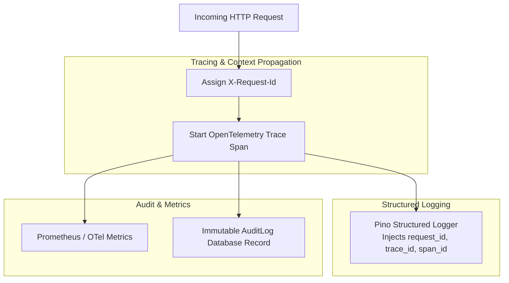

# Observability Architecture & Standards

Veylix implements a comprehensive observability strategy comprising structured logging, distributed tracing, and system metrics.

---

## 1. Observability Pillars



---

## 2. Structured JSON Logging (Pino)

- Production logs are emitted as single-line JSON objects to standard output (`stdout`).
- `console.log` is strictly prohibited in production code.
- Field Schema:
  ```json
  {
    "timestamp": "2026-09-09T22:31:14.842Z",
    "level": "info",
    "service": "veylix-api",
    "environment": "production",
    "event": "asset.transferred",
    "message": "Asset transferred successfully to employee",
    "request_id": "req_01J8K3M90ABCDEF",
    "trace_id": "4bf92f3577b34da6a3ce929d0e0e4736",
    "span_id": "00f067aa0ba902b7",
    "user_id": "usr_01J8K...",
    "resource_type": "asset",
    "resource_id": "ast_01J8K...",
    "duration_ms": 42,
    "metadata": {
      "fromEmployeeId": "emp_1001",
      "toEmployeeId": "emp_1002",
      "patrimonyNumber": "AST-2026-0042"
    }
  }
  ```

---

## 3. Secret Redaction Rules

Pino's automatic redaction serializer scrubs all sensitive fields prior to logging:

- `password`, `passwordConfirm`, `currentPassword`, `newPassword`
- `authorization`, `cookie`, `session_token`
- `token`, `secret`, `apiKey`
