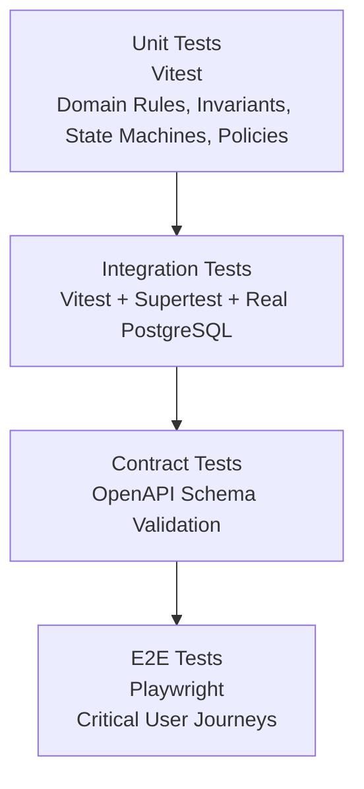

# Test Strategy & Quality Assurance Architecture

Veylix enforces a pragmatic, comprehensive testing strategy anchored by a robust Test Pyramid.

---

## 1. Test Pyramid Levels

### 1.1 Unit Tests (Vitest)

- **Scope**: Pure domain logic, State Machine transitions, Invariant guards (`INV-001` through `INV-007`), Authorization Policies, Value Objects, and utility parsers.
- **Characteristics**: Fast (sub-second execution), zero external I/O or network dependencies, fully mocked infrastructure.
- **Target Coverage**: High density on domain rules.

#### 1.1.1 Property-Based Testing (`fast-check`)

- **Framework**: `fast-check` integrated with Vitest runners.
- **Scope**: Exhaustive property testing on domain state machine transitions (`AssetStateMachine`) and input validation schemas (`@veylix/validation`).
- **Invariants Verified**:
  - `INV-001`: An asset with an active custodian cannot be assigned regardless of status.
  - `INV-002`: `RETIRED` or `LOST` assets permanently reject any movement or maintenance attempt across all arbitrary parameter permutations.
  - `INV-003`: `MAINTENANCE` status rejects all assignments, transfers, returns, and retirements.
  - Transfer identity guards: Transfers to the same employee or from a non-custodian are unconditionally rejected.
  - Schema fuzzing: Validation schemas gracefully handle thousands of arbitrary generated strings and inputs without uncaught runtime exceptions.

### 1.2 Integration Tests (Vitest + Supertest + PostgreSQL)

- **Scope**: NestJS Application Services, Repositories, Prisma transactions, Optimistic locking behavior, Database constraints, and REST controllers.
- **Characteristics**: Runs against a real PostgreSQL instance (via local Docker or Testcontainers) or mock Prisma transactions with automated verification.
- **Focus**: Positive and negative authorization tests, foreign key integrity, concurrent transfer race conditions.

#### 1.2.1 Concurrency & Race Condition Verification

- **Optimistic Locking**: Verified in `test/concurrency.spec.ts` ensuring that simultaneous updates with outdated versions trigger Prisma error `P2025` and surface as `409 ConflictException` (`INV-007`).
- **Pessimistic Row Locking (`SELECT FOR UPDATE`)**: Verified within atomic transactions (`INV-004`, `INV-007`), guaranteeing sequential execution of concurrent transfers and immediate rejection of conflicting custody changes.

### 1.3 Contract Tests

- **Scope**: Validates that the OpenAPI 3.1 specification generated by NestJS accurately matches the frontend API client models, preventing runtime drift.

### 1.4 End-to-End (E2E) Tests (Playwright)

- **Scope**: Critical user journeys across the web application (e.g. Login $\to$ Asset Creation $\to$ Custody Transfer $\to$ Verification in Movement Timeline).
- **Characteristics**: Executes in headless Chromium/Firefox/WebKit against running frontend and backend containers.

### 1.5 Accessibility & Security Tests

- **Accessibility**: Automated checks using `axe-core` on all Design System primitives and core dashboard views.
- **Security Test Suite**: Dedicated suite in `tests/security/` verifying IDOR resistance, CSRF protection, rate limiting, mass assignment blocking, and session invalidation.

---

## 2. Definition of Done for Testing

Before merging any change:

- Every new business rule has an accompanying unit test.
- Every new/modified API endpoint has integration tests covering 200, 400, 401, 403, and 409 scenarios.
- Every bugfix includes a regression test reproducing the original defect.
